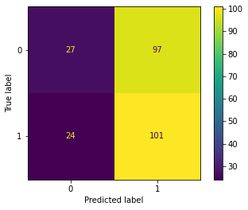
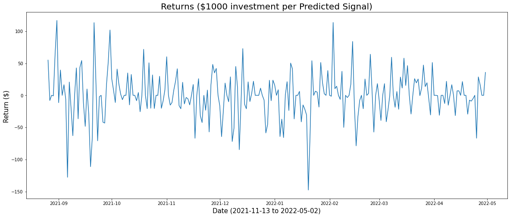
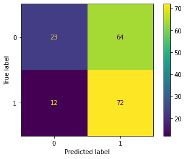
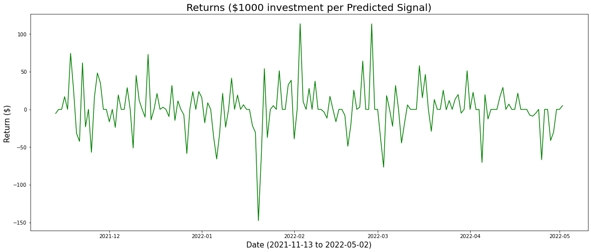
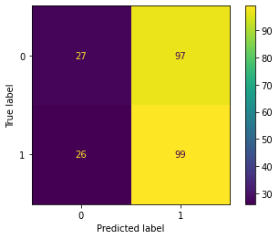
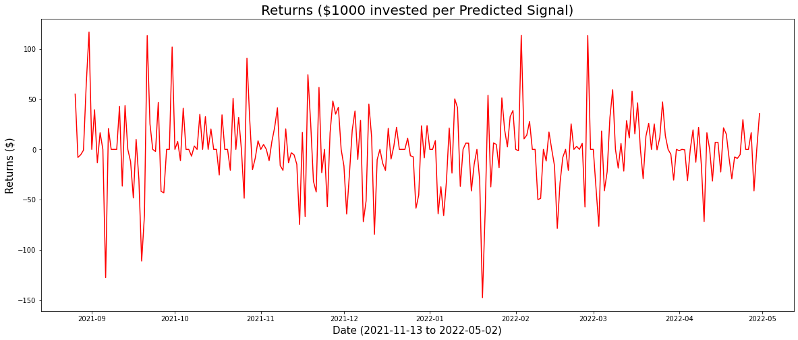

# Ethereum Price Signals

## How To Navigate Through the Repo

## Overview
This project analyzes the data from Twitter about cryptocurrency sentiment and the trading data from Yahoo Finance. Base on the dataset, we are using machine learning models to determine the purchase of Ethereum in the future.

## Business Problem
The cryptocurrencies have been on the rise worldwide since 2020. The global market cap at the moment is measured at $1.4 trillion. Ethereum makes up about 20% of the market. 
J.P. Morgan Chase is looking to expand crypto footprint, and we are suggesting to invest in Ethereum. 

Our model's purpose is to classfy the purchase decision to buy or not by each day. So the company can capitalize on their Ethereum investment.

## Data Understanding
From Tweeter, we scraped all Tweets from top 100 crypto users (`crypto_tweets.csv`). The time period that we selected was from Jan 1, 2020 to May 1, 2022. 

We also gathered Ethereum data (`eth_data.csv`) from Yahoo Finance, which has daily price info along with volume for the same time period.

## Methods
This project uses NLP models, Time Series, and ML models to predict suggestions for future Ethereum purchasing decisions. The first model uses the NLP to analyze topics from over one million Tweets. The second model uses only the financial metrics as the predictors to perform. Our final model combines both the daily sentiment analysis and the financial metrics.

Model with Tweet analysis: 52% Accuracy
Returns($1000 investment per Predicted Signal): 75¢ per day

Model with financial metrics: 55.6% Accuracy
Returns($1000 investment per Predicted Signal): $2.28 per day

Model combined: 51% Accuracy
Returns($1000 investment per Predicted Signal): -0.30¢ per day

## Conclusions
Our financial metrics model yields the best result. Contrary to our initial belief, combining both the sentiment and financial data does not yield a good model.

## Next Step
Futher analyses could yield additional insights to improve to our prediction models:

- Better sampling of crypto tweets would lead to better topic modeling
- Different time variations:
    - Long Term: 1 month, 1 week charts
    - Short Term: 1 hour, 30 min charts
- Combining different sources of crypto sentiment (Telegram, Instagram, ...etc)
- Testing other technical strategies
